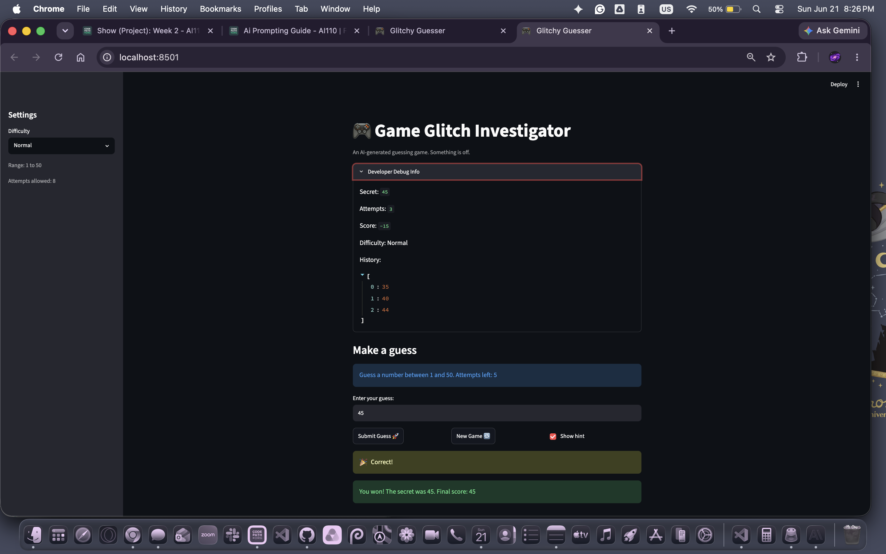

# 🎮 Game Glitch Investigator: The Impossible Guesser

## 🚨 The Situation

You asked an AI to build a simple "Number Guessing Game" using Streamlit.
It wrote the code, ran away, and now the game is unplayable. 

- You can't win.
- The hints lie to you.
- The secret number seems to have commitment issues.

## 🛠️ Setup

1. Install dependencies: `pip install -r requirements.txt`
2. Run the broken app: `python -m streamlit run app.py`

## 🕵️‍♂️ Your Mission

1. **Play the game.** Open the "Developer Debug Info" tab in the app to see the secret number. Try to win.
2. **Find the State Bug.** Why does the secret number change every time you click "Submit"? Ask ChatGPT: *"How do I keep a variable from resetting in Streamlit when I click a button?"*
3. **Fix the Logic.** The hints ("Higher/Lower") are wrong. Fix them.
4. **Refactor & Test.** - Move the logic into `logic_utils.py`.
   - Run `pytest` in your terminal.
   - Keep fixing until all tests pass!

## 📝 Document Your Experience

- [x] Describe the game's purpose.
- [x] Detail which bugs you found.
- [x] Explain what fixes you applied.

## 📸 Demo Walkthrough

Describe your fixed game in numbered steps so a reader can follow along without watching a video:

1. **Open the app** — launch `streamlit run app.py` and the "Glitchy Guesser" page loads in your browser.

2. **Choose a difficulty** in the left sidebar: Easy (1–20, 6 attempts), Normal (1–50, 8 attempts), or Hard (1–100, 7 attempts). The range and attempt count update instantly.

3. **Read the prompt** — the info box at the top shows the correct range for your chosen difficulty (e.g. "Guess a number between 1 and 50"), not a hardcoded "1 and 100."

4. **Type a number** in the text input and click **Submit Guess**. Only valid integers count — typing gibberish shows an error but does *not* use up an attempt.

5. **Read the hint** — if "Show hint" is checked, you'll see either "📉 Go LOWER!" or "📈 Go HIGHER!" The hints now point in the correct direction (they were reversed in the original).

6. **Watch your score and attempts** — the attempt counter starts at 0 and increments by 1 per valid guess. A first-guess win awards 90 points; each additional guess costs 10, with a floor of 10. "Too High" guesses on even attempts add a small bonus; odd attempts deduct a small penalty.

7. **Win or lose** — guess the secret number to trigger balloons and see your final score. Run out of attempts and the secret is revealed with a game-over message.

8. **Start a New Game** — click **New Game** to reset the secret, attempts, score history, and game status. The new secret is drawn from the currently selected difficulty range.

9. **Switch difficulty mid-game** — changing difficulty immediately regenerates a secret within the new range and resets all state, so the number is always valid for the range shown.

10. **Check the debug panel** *(optional)* — expand "Developer Debug Info" to see the secret number, attempt count, score, and full guess history at any point.

**Screenshot** *(optional)*: 

## 🧪 Test Results

```
$ python3 -m pytest tests/test_game_logic.py
============================== 30 passed in 0.05s ==============================
```

## 🚀 Stretch Features

- [x] **SF7 — Test Generation:** Used Claude to suggest edge-case tests for `update_score` (zero/negative `attempt_number` → `ValueError`) and `check_guess` (string secret → `TypeError`). Tests documented in `ai_interactions.md`.
- [x] **SF8 — Agent Workflow:** Asked Claude Sonnet 4.6 to investigate the broken game end-to-end: read both files, identify all bugs, apply fixes, and write 23 pytest tests. One misdiagnosis (hint bug blamed on the counter instead of the `str()` coercion) caught and corrected manually. Documented in `ai_interactions.md`.
- [x] **SF9 — Linting & Style:** Ran `flake8` on `app.py` and `logic_utils.py`; fixed all 29 warnings (E262/E265 comment format, E501 line length, W291 trailing whitespace). Zero warnings remain; all 23 tests still pass. Documented in `ai_interactions.md`.
- [x] **SF11 — Model Comparison:** Ran Claude Haiku 4.5 and Claude Sonnet 4.6 on the same task (explain the `str()` coercion bug and suggest a Pythonic fix). Both correct; Sonnet caught an additional failure mode (`42 == "42"` is `False`, so players could never win on even attempts). Documented in `ai_interactions.md`.
